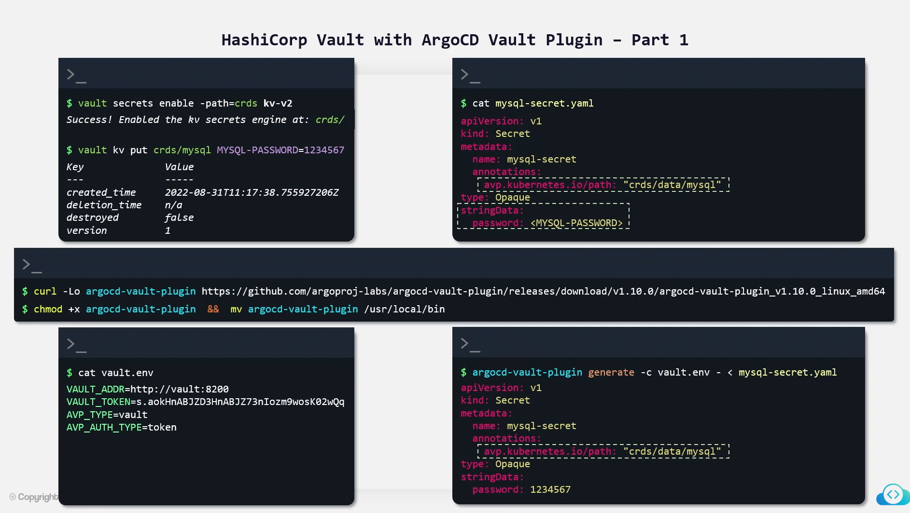

# ArgoCD

<figure><figcaption></figcaption></figure>

<figure><figcaption></figcaption></figure>

**Reconcilation Process** : the process of matching actual K8s resource state with desired state.\
**Reconcilation Loop** is how often(frequency/interval) your argocd reconcile with git repository. Argocd timeout of reconcilation is 3 mins.

**webhook url in git  : \<argocdurl>/api/webhook**

<figure><figcaption></figcaption></figure>

<figure><figcaption></figcaption></figure>

**Apps of App Pattern in ArgoCD:**&#x20;

In Argocd, we can create multiple apps declaratively (like having defination of application in  file) by configuring single app that would be looking out for all the argocd apps for its defination in specific directory

you can override the values in values.yaml by using \
`--helm-set <property_name>=<property_value>`\

Okta connectivity configuration

<figure><figcaption></figcaption></figure>

In gitops practice everything should be stored in git but storing secrets in git repo present in public domain can be risky. so people can handle it through Bitnami sealed secrets or through Harshicorps Vault.&#x20;

**Bitnami sealed secrets** it uses  `kubeseal` cli utility that converts normal secret to bitnami sealed secrets, which then can be push to git without hesitation as it can be decrypted only by bitnami controller. please refer below screenshot

<figure><figcaption></figcaption></figure>

**Harshicorp Vault :**&#x20;

<figure><figcaption></figcaption></figure>

<figure><figcaption></figcaption></figure>


